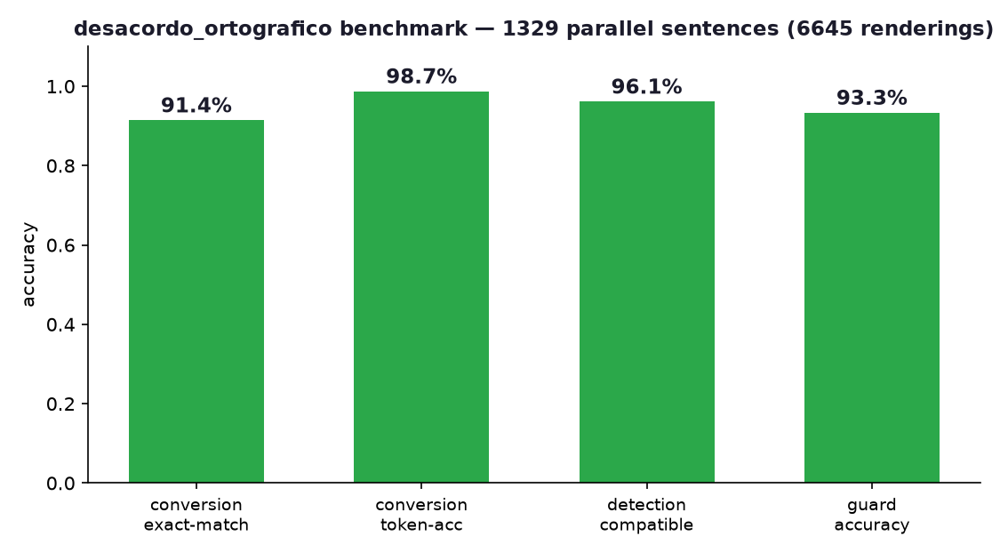
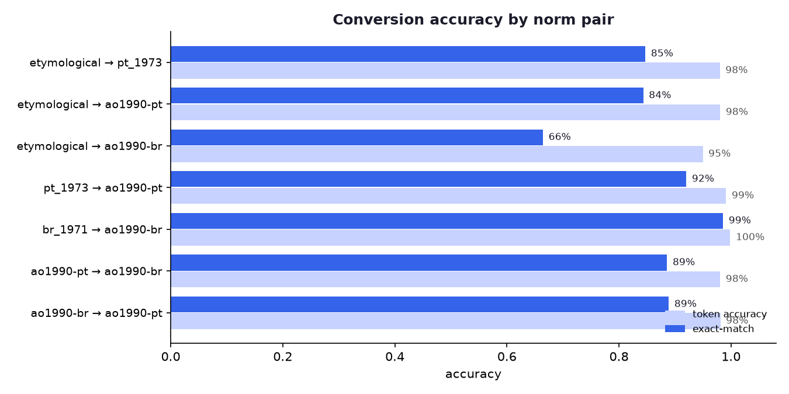
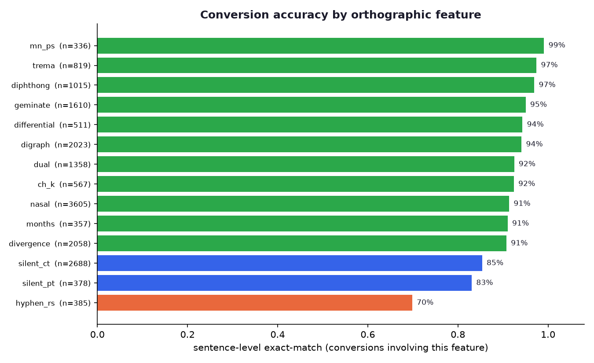
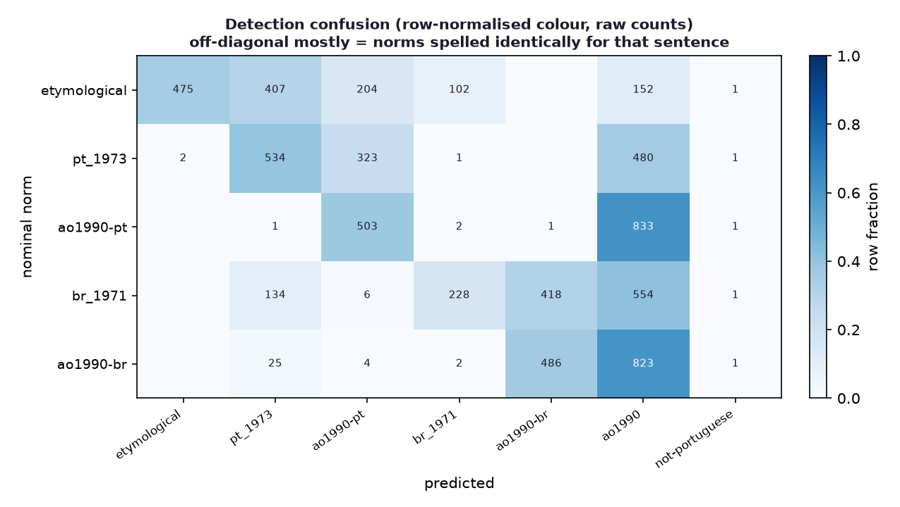

# Benchmark

A parallel gold corpus and an evaluation harness for `desacordo_ortografico`.

## What it measures

Each gold item is **one Portuguese sentence written in five orthographic norms** —
`etymological` (pre-1911), `pt_1973` (pre-AO1990 European), `ao1990-pt`, `br_1971`
(pre-AO1990 Brazilian), `ao1990-br`. From this, `run_benchmark.py` measures:

- **Conversion** — convert the gold rendering of one norm into another and check it
  reproduces the gold target (exact-match + token accuracy), per norm pair and per
  orthographic feature.
- **Detection** — classify every rendering and check the predicted norm is *compatible*
  with the column(s) it came from (renderings that are spelled identically across norms
  share an acceptable set). Plus a confusion matrix.
- **Guard** — sister-language samples (`gold_sisters.jsonl`) must be flagged as the
  right non-Portuguese variety; Portuguese controls must not be flagged.

The parallel corpus is also published as a dataset:
**[TigreGotico/desacordo_ortografico](https://huggingface.co/datasets/TigreGotico/desacordo_ortografico)**
on the Hugging Face Hub — **21,796 sentences × 5 norms** (`parallel` + `sisters` configs),
each row tagged `source: authored | derived`. Regenerate/republish with `publish_hf.py`.

## Scaling by verified derivation

`gold_corpus.jsonl` is the 1,329-sentence authored+QA'd benchmark core. The dataset is
grown to reference scale by `derive.py`: a natural modern-European sentence is turned into
all five norms by **per-word table lookup + deterministic rules** (nasal vowel, trema,
month casing). Every word is transformed only via a form verified against a curated
lexicon — the silent-consonant, trema and blocker vocabularies (`derived_lexicon.json`,
3,556 PT-line forms + 34 BR trema words) were classified word-by-word by a language-model
panel. Any sentence containing a word whose variation is not verified is **dropped**, so a
derived row is correct by construction; independent sampling found zero spelling errors.
`derive_corpus.py` runs this over the generated sentences and infers each row's features.
The benchmark below stays on the authored core (deriving against the library would be
circular); the full 20k+ corpus is the HF dataset.

## The corpus

`gold_corpus.jsonl` = a small hand-authored core (`gold_parallel.jsonl`, multi-feature
natural sentences) + an LLM-authored bulk (`parts/part_*.jsonl`, ~1300 sentences across
12 topic domains). Every rendering was produced from linguistic knowledge against an
explicit per-norm rule card — **not** generated by the library under test, so the corpus
is an independent gold standard.

The corpus is then **tightened to reference quality** by `clean_gold.py`. Because the
European line (etymological / pt_1973 / ao1990-pt) and the Brazilian line (br_1971 /
ao1990-br) may legitimately differ in *lexis* (ficheiro/arquivo), consistency is checked
**within each line**, where cells differ only by era transforms. The cleaner (a) forces
dual/divergence words to the correct variant in the unambiguous modern cells and
(b) **drops, never silently rewrites,** any sentence whose European or Brazilian line is
internally inconsistent (article slips, different words, token-count mismatches). The
output is provably self-consistent: 1341 → 1316 sentences, 25 dropped, and 0 residual
line inconsistencies.

Note on PT↔BR conversion: the European and Brazilian lines can diverge *lexically*
(quinta/fazenda), which an orthographic converter correctly does not translate — so the
cross-variant pairs are capped below 100% by design, not by a bug.

## Reproduce

```bash
pip install -e . matplotlib            # plus tugalex
python benchmark/build_corpus.py       # merge + validate parts -> gold_corpus.jsonl
python benchmark/clean_gold.py         # tighten to reference quality (drops inconsistent)
python benchmark/run_benchmark.py      # -> results.md + results.json
python benchmark/plot_results.py       # -> plots/*.png
python benchmark/train_detector.py     # CV the learned detectors + ship models
python benchmark/diagnose.py           # attribute failures (rule vs gold, where)
```

## Headline results



- **Conversion:** ~88% sentence-level exact-match, ~98% token accuracy over ~9.2k
  directed conversions. The same-line conversions are strongest
  (`br_1971→ao1990-br` ~99%, `pt_1973→ao1990-pt` ~96%); the cross-variant PT↔BR pairs
  (~89%) are capped by lexical divergence, and the pre-1911 directions by accent
  restoration (see limitations).
- **Detection:** ~94% compatible accuracy (rules) across 6.6k renderings; the learned
  models reach ~96% (below).
- **Guard:** flags Mirandese / Galician / Barranquenho correctly and leaves Portuguese
  alone, modulo one Astur-Leonese sentence whose only cue is a medial diphthong the
  marker set doesn't cover.





## Learned detectors (NB + perceptron)

`train_detector.py` trains two zero-dependency models over character n-grams and
evaluates them against the rule scorer with **5-fold CV split by sentence** (so no
near-identical rendering leaks across train/test). Both beat the rules on held-out data:

| detector | strict | compatible |
|----------|--------|------------|
| rules | 33.3% | 94.4% |
| naive bayes | 49.2% | **96.2%** |
| averaged perceptron | 48.6% | 95.1% |

(Strict accuracy is capped well below 100% because many renderings are spelled
identically across norms and cannot be told apart; *compatible* is the meaningful
metric.) Both models ship (`data/detector_nb.json`, `data/detector_perceptron.json`)
and are opt-in via `detect(text, method="nb"|"perceptron")`; the rule scorer stays the
default for explainability and robustness on short inputs.

## Known limitations the benchmark exposes

- **Graphic-accent restoration (etymological edge).** The 1911 reform *introduced*
  systematic accents, so the deterministic `ph→f`/`y→i` rules cannot supply them. The
  library restores accents from the word list where unambiguous (`fosforo→fósforo`), but
  a pre-1911 word absent from the list keeps a bare vowel.
- **Inflected silent consonants.** Dropping the silent c/p of `-ct-/-pt-` is lexical;
  the rule fallback only fires when the modernised form is an attested word, so
  inflections missing from the word list (`desactiva→desativa`) are left unchanged. A
  richer word list (e.g. enriching tugalex) closes this directly.
- **Reverse (newer→older) conversions** are lexical and lossy by nature, and are
  reported via `ConversionResult.lossless`/`warnings`.
